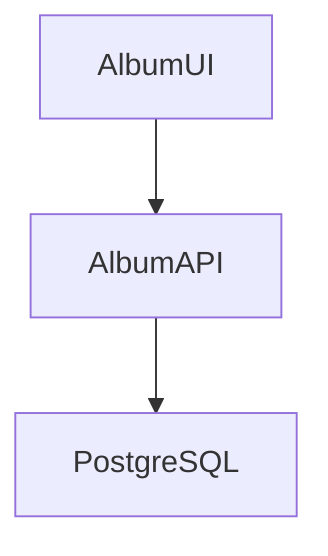

# Album View UI

Album API と連携して利用するフロントエンドのサービスです。



このアプリケーションは、nodejs で作られていた https://github.com/akubicharm/containerapps-albumui を AI を使って、Java(Spring Boot) + Thymeleaf に書き換えたものです。
バックエンドのサービスは https://github.com/akubicharm/containerapps-albumapi-java または https://github.com/akubicharm/containerapps-albumapi-javascript を参照。

## ローカル環境

### ビルド

```sh
mvn package
```

### 実行

```sh
mvn spring-boot:run
```

### 動作確認

`http://localhost:8080` にアクセス

ポートを変更したい場合は、`src/main/resources/application.yaml` を編集

Tomcatにデプロイして利用する方法は、[misc/Readme.md](/misc/Readme.md) 参照

