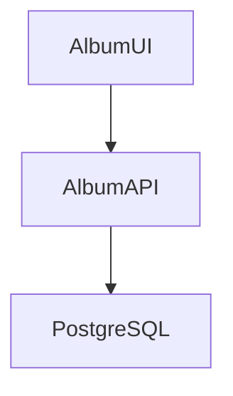

# Album View UI

Album API と連携して利用するバックエンドのサービスです。



## ローカル環境

### ビルド

```sh
mvn package
```

### 実行

```sh
mvn spring-boot:run
```

### 動作確認

`http://localhost:3000` にアクセス
ポートは `src/main/resources/application.yaml` で定義

