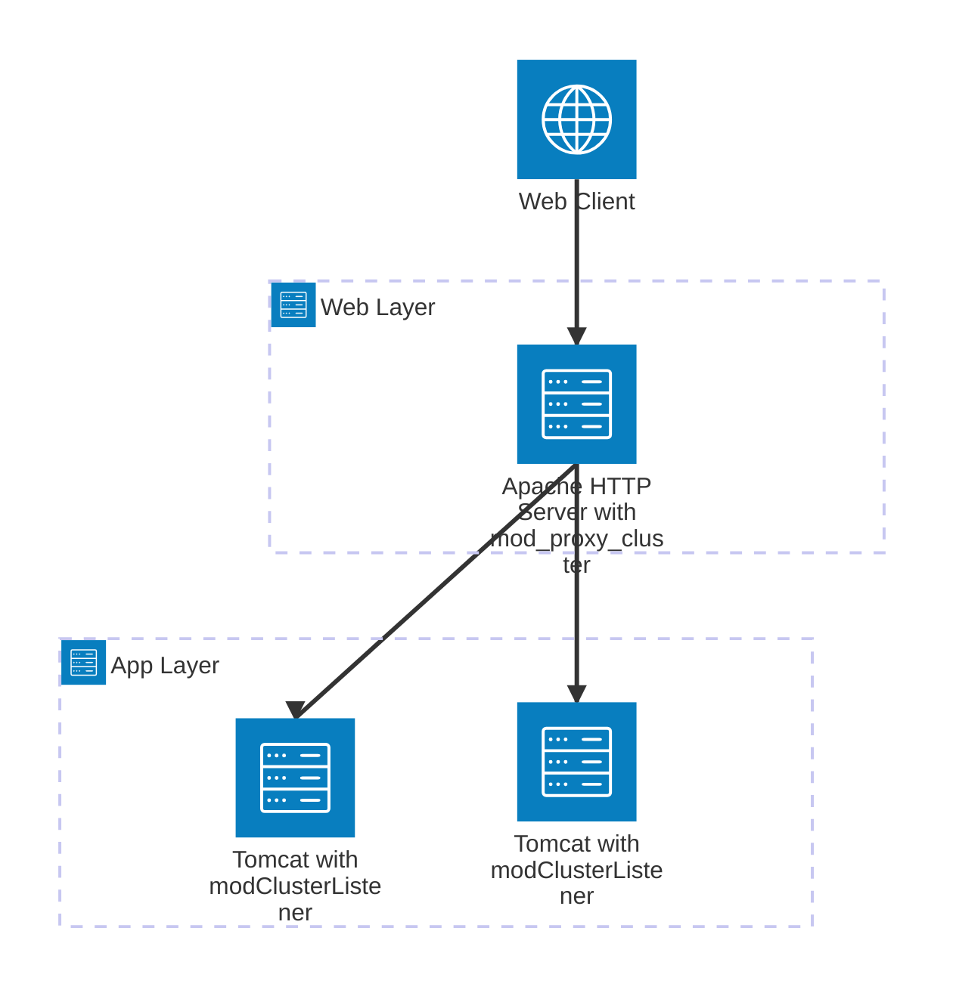
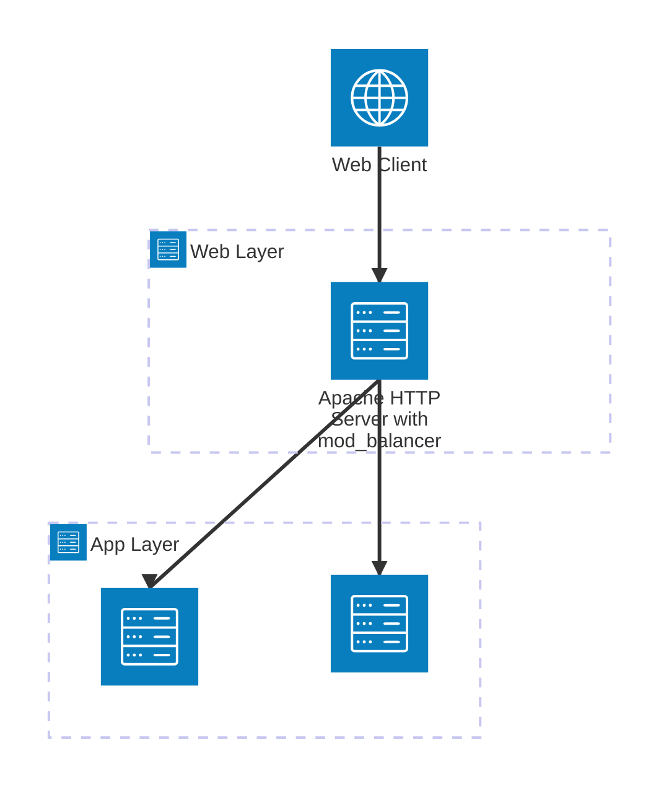

# Apach + Tomcat の連携　（コンテナ）

コンテナイメージは[Red Hat Ecosystem Catalog](https://catalog.redhat.com/en/search?searchType=Containers) で公開されているものを利用。

## Apache HTTP Server + JBoss Web Server (mod_proxy_cluster)

実行環境はコンテナ環境は[container-mod_proxy_cluster](./container-mod_proxy_cluster)を、ImageMode for RHELは[imagemode-mod_proxy_cluster](./imagemode-mod_proxy_cluster/)を参照。

### アーキテクチャ



### Apache HTTP Server

mod_proxy_clusterを利用して、App層のTomcatへのロードバランサーの役割を果たす。

mod_proxy_clusterを利用する場合
- mod_proxy_clusterは、httpdのコンテナイメージには含まれていないので、別途インストールする
- mod_proxy_clusterを使う場合は、mod_proxy_balancerモジュールを無効にする(/etc/httpd/conf.modules.d/00-proxy.conf からエントリを削除)


`mod_proxy_cluster.conf` でTomcatからのクラスターへの参加リクエストを受け付ける manager module の設定を定義。
このデモ環境の設定では、manager moduleは 8090 ポートでリクエストを待つ。リクエストの送信元を許可する設定の　Require ip にマッチしないホストからのリクエストは受け付けないので、ひとまず `all granted` にしている。

mod_proxy_cluster 設定の詳細は、[Red Hat JBoss Core ServicesのApache HTTPServerコネクターおよび負荷分散ガイド](https://docs.redhat.com/ja/documentation/red_hat_jboss_core_services/2.4.62/html/apache_http_server_connectors_and_load_balancing_guide/index)を参照。

### JBoss Web Server

ウェブアプリケーションを提供するサーバ。
mod_proxy_clusterのリスナーとして登録するための設定を `server.xml` に設定。proxyListは apche http serverのホスト名 or IPアドレスと、manager moduleがリッスンしているポートを指定。

```
  <Listener className="org.jboss.modcluster.container.catalina.standalone.ModClusterListener" proxyList="httpd:8090"/>

```

### 動作確認　- コンテナ環境

Macなどで実行する場合は、(conatiner-mod_proxy_cluster)[container-mod_proxy_cluster]ディレクトリのファイルを利用。
RHEL で bootc のコンテナを利用する場合は (imagemode-mod_proxy_cluster)[imagemode-mod_proxy_cluster] ディレクトリのファイルを利用。


#### Apache　単体

`httpd/Dockerfile` でコンテナイメージを作成して実行

```sh
podman build . -t httpd 
```

```sh
podman run --rm --name httpd -p 8080:8080 -p 8090:8090 httpd
```

(mod_proxy_clusterを正規の方法でインストールしていないので、Fedora Projectで公開されているmod_proxy_clusterを使っている。。。https://packages.fedoraproject.org/pkgs/mod_proxy_cluster/mod_proxy_cluster/

正しくインストールするならば、`dnf install mod_proxy_cluster`)

#### Tomcat 単体

##### nativeで環境で実行する場合

JBoss Web Server を[Red Hat Customer Portal](https://access.redhat.com/downloads/content/application-services/core.service.apachehttp) からダウンロード。

`conf/server.xml` を [./tomcat/server.xml](./tomcat/server.xml) に置き換える。

- 起動と停止
```sh
jws-7.0/tomcat/bin/startup.sh
jws-7.0/tomcat/bin/shutdown.sh
```

##### コンテナ環境で実行する場合

OpenJDK 25環境を利用したい場合は、Red Hat Container CatalogにJDK25バージョンのJBoss Web Serverが公開されていないので（as of 2026/9/1)、OpenJDKのイメージにJWSをインストールし、アプリケーション配備したコンテナイメージを作成する。
※Tomcatの実行に使う JDK とアプリケーションのJDKのバージョンが違っていると 404 エラーになるので要注意。


```sh
podman build . -t jws
```

```sh
podman run --rm --name tomcat -p 8080:8080 jws
```

#### Apache + Tomcat の環境

Apache と Tomcat が双方向で通信できる状態の必要があるので `podman compose` を使って、両方のコンテナが同一の仮想ネットワーク(Bridge Network)に接続して起動する。

```
podman network create web
podman compose up
```

## Apache HTTP Server + Tomcat (mod_balancer)

実行環境はコンテナ環境は[container-mod_balancer](./container-mod_balancer)を、ImageMode for RHELは[imagemode-mod_balancer](./imagemode-mod_balancer/)を参照。

### アーキテクチャ




### Apach HTTP Server

mod_proxy_balancer を使って、バックエンドの Tomcat へのロードバランサーの役割を果たす。
mod_proxy_clusterとは異なり、バックエンドのサーバを登録しておく必要がある。


### Tomcat

ウェブアプリケーションを提供するサーバ。


### 動作確認　- コンテナ環境


Macなどで実行する場合は、(conatiner-mod_balancer)[container-mod_balancer]ディレクトリのファイルを利用。
RHEL で bootc のコンテナを利用する場合は (imagemode-mod_balancer)[imagemode-mod_balancer] ディレクトリのファイルを利用。


#### Apache 単体


`httpd/Dockerfile` でコンテナイメージを作成して実行

```sh
podman build . -t httpd 
```

```sh
podman run --rm --name httpd -p 8080:8080 -p 8090:8090 httpd
```

#### Tomcat　単体


```sh
podman build . -t tomcat
```

```sh
podman run --rm --name tomcat -p 8080:8080 tomcat
```

#### Apache + Tomcat

Apache と Tomcat が双方向で通信できる状態の必要があるので `podman compose` を使って、両方のコンテナが同一の仮想ネットワーク(Bridge Network)に接続して起動する。

```
podman network create web
podman compose up
```
